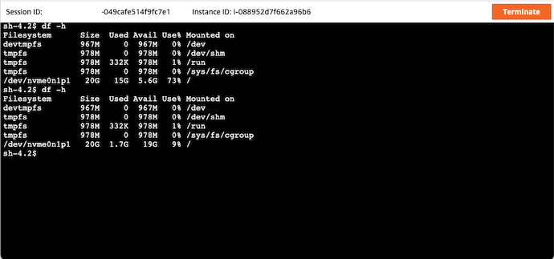

[[English](README.md)] [[한국어](README.ko.md)]

# 시스템 매니저(AWS Systems Manager)
[시스템 매니저(AWS Systems Manager)](https://aws.amazon.com/systems-manager/)는 여러 분의 AWS 인프라스트럭처에 대한 가시성과 제어권을 제공합니다. 시스템 매니저는 통합 환경을 제공하여, 다양한 AWS 서비스의 운영 관련 데이터를 모아 볼 수 있도록 해주고 AWS 자원에 대해 운영 작업을 자동화할 수 있도록 해줍니다.

## 예제
- [Amazon EC2 Blueprint](https://github.com/Young-ook/terraform-aws-ssm/tree/main/examples/blueprint)
- [AWS FIS Blueprint (Chaos Engineering)](https://github.com/Young-ook/terraform-aws-fis/blob/main/examples/blueprint)

## 시작하기
### AWS CLI (Command-Line Interface)
다음의 공식 안내 문서를 참고하여 AWS CLI 설치 및 설정을 할 수 있습니다.
- [AWS CLI Installation](https://docs.aws.amazon.com/cli/latest/userguide/cli-chap-install.html)
- [AWS CLI Configuration](https://docs.aws.amazon.com/cli/latest/userguide/cli-configure-profiles.html)

설치를 완료했다면, 버전 확인을 통해 설지가 잘 되었는 지 판단할 수 있습니다:
```
aws --version
aws-cli/2.5.8 Python/3.9.11 Darwin/21.4.0 exe/x86_64 prompt/off
```

### 테라폼(Terraform)
테라폼은 여러 분의 인프라스트럭처를 안전하게, 그리고 재현가능하게 생성하고 관리할 수 있도록 있도록 만들어주는 오픈소스 소프트웨어 도구 입니다.

#### 설치
공식 문서의 안내에 따라 테라폼 실행 바이너리 파일을 설치합니다. 자세한 안내사항은 [Install Terraform](https://learn.hashicorp.com/tutorials/terraform/install-cli) 문서를 참조하시길 바랍니다.

또는, 직접 특정 버전의 테라폼을 선택해서 설치할 수 있습니다. [Downloads](https://www.terraform.io/downloads.html)페이지로 이동해서 여러 분의 시스템 환경에 맞는 패키지를 찾습니다. 그리고 압축 파일을 선택한 뒤 내려 받습니다. 압축을 풀면 생성되는 파일을 여러 분의 `PATH` 경로에 포함된 디렉토리로 옮겨서 설치를 완료합니다.

또는, [tfenv](https://github.com/tfutils/tfenv)를 사용할 수 있습니다. 여러 버전의 테라폼 실행 파일을 설치하고 변경하는 일을 쉽게 만들어 주는 도구입니다.

먼저, brew를 이용해서 tfenv를 설치합니다.
```
brew install tfenv
```
다음, tfenv를 이용해서 테라폼을 설치할 수 있습니다.
```
tfenv install <version>
tfenv use <version>
```
또한 이 도구는 테라폼 버전 v0.12로 업그레이드 하는 것에 유용합니다. 해당 버전은 테라폼의 언어 관련한 개선 사항이 포함된 중요한 배포판입니다. 그러나 0.11 버전과 0.12 버전은 매우 다릅니다. 그래서 만약 몇몇 코드가 이전 버전으로 되어 있고, 나머지는 0.12 버전일 수도 있습니다. 그런 경우 이 도구를 이용하여 테라폼 실행 버전을 간단한 명령 한 줄로 전환할 수 있습니다.
```
tfenv list
tfenv install latest
tfenv use <version>
```

### 생성
```
module "ec2" {
  source  = "Young-ook/ssm/aws"
  name    = "ssm"
  tags    = { env = "test" }
}
```
테라폼 실행:
```
terraform init
terraform apply
```

### 연결
예제에서 사용한 EC2 인스턴스는 시스템 매니저를 사용해서 접속할 수 있습니다. AWS 관리 콘솔화면에서 EC2 서비스 페이지로 이동합니다. 인스턴스를 선택하고 '연결' 또는 'Connect' 단추를 누릅니다. 그러면, EC2를 접속할 수 있는 여러 방법이 표시되는데, 그 중 세션 매니저(Session Manager)를 선택합니다. 이 후 안내를 따라 인스턴스 내부에 접속합니다.


