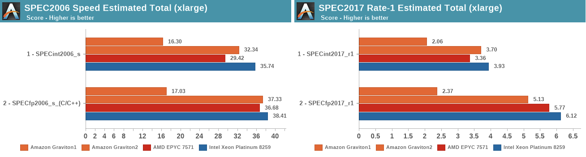

[[English](README.md)] [[한국어](README.ko.md)]

# EC2 Bluprint
This is EC2 Blueprint example helps you compose complete AWS Systems Manager managed EC2 clusters that are fully bootstrapped with the operational software that is needed to deploy and operate workloads. With this EC2 Blueprint example, you describe the configuration for the desired state of your EC2 environment, such as the control plane, worker nodes, and applications, as an Infrastructure as Code (IaC) template/blueprint. Once a blueprint is configured, you can use it to stamp out consistent environments across multiple AWS accounts and Regions using your automation workflow tool, such as Jenkins, CodePipeline. Also, you can use EC2 Blueprint to easily bootstrap an EC2 cluster with user-data for initial configuration whatever you want on your instance. EC2 Blueprints also helps you implement relevant security controls needed to operate workloads from multiple teams in the same cluster.

## Setup
### Prerequiesites
This example creates a script to display warm pools activities. This script uses a couple open source tools to parse the JSON response from a `DescribeScalingActivities` API call. Ensure you have [jq](https://stedolan.github.io/jq/download/) and [dateutils](http://www.fresse.org/dateutils/) installed in your environment.

**macOS**
```
brew install jq dateutils
```

### Download
Download this example on your workspace
```
git clone https://github.com/Young-ook/terraform-aws-ssm
cd terraform-aws-ssm/examples/blueprint
```

Then you are in **blueprint** directory under your current workspace. There is an exmaple that shows how to use terraform configurations to create and manage an EC2 cluster and utilities on your AWS account. Check out and apply it using terraform command. If you don't have the terraform and kubernetes tools in your environment, go to the main [page](https://github.com/Young-ook/terraform-aws-ssm) of this repository and follow the installation instructions before you move to the next step.

Run terraform:
```
terraform init
terraform apply
```
Also you can use the *-var-file* option for customized paramters when you run the terraform plan/apply command.
```
terraform plan -var-file fixture.tc1.tfvars
terraform apply -var-file fixture.tc1.tfvars
```

## Computing options
### AWS Graviton
[AWS Graviton](https://aws.amazon.com/ec2/graviton/) processors are custom built by Amazon Web Services using 64-bit ARM Neoverse cores to deliver the best price performance for you cloud workloads running on Amazon EC2. The new general purpose (M6g), compute-optimized (C6g), and memory-optimized (R6g) instances deliver up to 40% better price/performance over comparable current generation x86-based instances for scale-out and Arm-based applications such as web servers, containerized microservices, caching fleets, and distributed data stores that are supported by the extensive Arm ecosystem. You can mix x86 and Arm based EC2 instances within a cluster, and easily evaluate Arm-based application in existing environments. Here is a useful [getting started](https://github.com/aws/aws-graviton-getting-started) guide on how to start to use AWS Graviton. This github repository would be good point where to start. You can find out more details about how to build, run and optimize your application for AWS Graviton processors.


*source*: [AnandTech](https://www.anandtech.com/show/15578/cloud-clash-amazon-graviton2-arm-against-intel-and-amd)

## Applications
- [Warm Pools](./apps/README.md#ec2-auto-scaling-warm-pools)

## Clean up
To destroy all infrastrcuture, run terraform:
```
terraform destroy
```

If you don't want to see a confirmation question, you can use quite option for terraform destroy command
```
terraform destroy --auto-approve
```

**[DON'T FORGET]** You have to use the *-var-file* option when you run terraform destroy command to delete the aws resources created with extra variable files.
```
terraform destroy -var-file fixture.tc1.tfvars
```

# Additional Resources
## Amazon EC2
- [Scaling your applications faster with EC2 Auto Scaling Warm Pools](https://aws.amazon.com/blogs/compute/scaling-your-applications-faster-with-ec2-auto-scaling-warm-pools/)
- [Using Auto Scaling lifecycle hooks, Lambda, and EC2 Run Command](https://github.com/aws-samples/aws-lambda-lifecycle-hooks-function)
- [Amazon EC2 Auto Scaling Group Examples](https://github.com/aws-samples/amazon-ec2-auto-scaling-group-examples)
- [New – Attribute-Based Instance Type Selection for EC2 Auto Scaling and EC2 Fleet](https://aws.amazon.com/blogs/aws/new-attribute-based-instance-type-selection-for-ec2-auto-scaling-and-ec2-fleet/)
- [Amazon EC2 Image Builder Samples](https://github.com/aws-samples/amazon-ec2-image-builder-samples)
- [Migrate your Amazon EBS volumes from gp2 to gp3 and save up to 20% on costs](https://aws.amazon.com/blogs/storage/migrate-your-amazon-ebs-volumes-from-gp2-to-gp3-and-save-up-to-20-on-costs/)
- [How to Automate Cost and Performance Improvement Through gp3 Upgrades Using AWS Systems Manager](https://aws.amazon.com/blogs/apn/how-to-automate-cost-and-performance-improvement-through-gp3-upgrades-using-aws-systems-manager/)

## AWS Graviton
- [AWS Graviton Getting Started](https://github.com/aws/aws-graviton-getting-started)
- [Reduce costs and improve sustainability with AWS Graviton](https://catalog.workshops.aws/graviton/en-US)

## AWS for Games
- [The Unique Architecture behind Amazon Games’ Seamless MMO New World](https://aws.amazon.com/blogs/gametech/the-unique-architecture-behind-amazon-games-seamless-mmo-new-world/)
