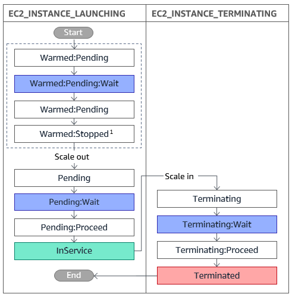
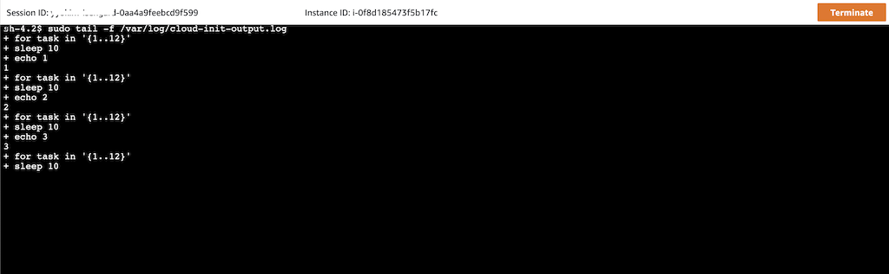
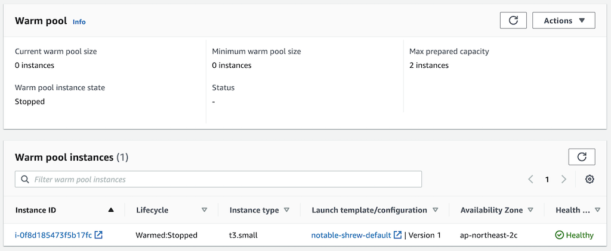
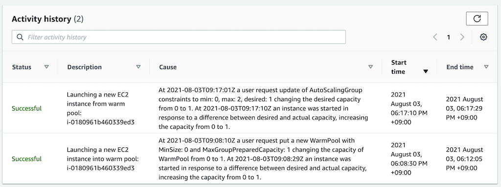

[[English](README.md)] [[한국어](README.ko.md)]

# 애플리케이션
## EC2 오토스케일링 그룹 웜풀
웜풀(Warm Pool)은 미리 초기화된 EC2 인스턴스들을 오토스케일링 그룹(Auto Sacling Group)에 함께 보관해두는 기능입니다. 여러 분의 어플리케이션이 수평 확장을 수행할 때 오토스케일링 그룹은 풀에서 인스턴스를 가져와서 사용할 수 있습니다. 웜풀은 사용자의 어플리케이션이 준비 시간이 특히 오래 걸리는 경우, 특히 인스턴스가 엄청난 양의 데이터를 디스크로부터 읽어야 하는 경우에 인스턴스가 서비스에 투입되는 시간을 줄여 줄 수 있습니다. 웜풀을 사용한다면, 빠른 대응을 위해 필요 이상으로 인스턴스를 생성해야할 필요가 없습니다. 보다 자세한 내용은 아마존 EC2 오토스케일링 사용자 안내서의, [EC2 오토스케일링 그룹 웜풀](https://docs.aws.amazon.com/autoscaling/ec2/userguide/ec2-auto-scaling-warm-pools.html)을 참조하시기 바랍니다.

### 웜풀 인스턴스 생명주기
웜풀의 인스턴스들은 각각의 생명주기 상태변화에 맞는 행동을 정의하기 위한 독립접인 생명주기를 가집니다. 이 생명주기는 인스턴스 시작시점부터 종료까지 달라지는 상태를 거쳐갑니다. 이러한 상태변화 과정 사이에 생명주기 훅(Hook)을 만들어서 특정 순간에 해야할 작업을 지정할 수 있습니다.

아래 그림은 각 상태변화를 표시한 것입니다:



### 검증
테라폼 명령을 수행하고 나면, 웜풀과 인스턴스를 볼 수 있습니다. 인스턴스는 user-data에 있는 스크립트를 활용하여 어플리케이션을 초기화 합니다. 이 스크립트에서는 초기화 작업이 오래 걸리는 상황을 가정한 내용이 포함되어 있습니다.



초기화가 완료되면 'Stopped' 상태로 전환되어 대기합니다.



웜풀 인스턴스가 초기화하는 데 걸린 시간을 확인하기 위하여, 생성된 스크립트를 실행합니다 (사전 준비사항에 언급한 도구가 반드시 있어야 합니다):
```
bash elapsedtime.sh
```
명령을 실행하면 다음과 같은 출력을 볼 수 있습니다.
```
Launching a new EC2 instance into warm pool: i-0180961b460339ed3 Duration: 215s
```

### 웜풀로부터 새 인스턴스 실행
[main.tf](https://github.com/Young-ook/terraform-aws-ssm/tree/main/examples/blueprint/main.tf) 파일을 열어서 *node_groups* 중 *warmpools*의 *desired_capacity* 값을 1로 변경합니다. 저장한 다음 다시 테라폼을 실행해서 변경 내용을 반영합니다.
```
terraform apply
```
변경할 내용이 표시됩니다. 확인하였다면, *yes* 를 입력해서 실제 적용합니다. 몇 분 후, 오토스케일링 그룹의 이력을 확인하기 위하여 다음 스크립트를 실행합니다.
```
bash elapsedtime.sh
```
출력 결과는 아래와 비슷할 것입니다. 웜풀로부터 가져와서 실행한 인스턴스는 실행시간이 단축된 것을 볼 수 있습니다.
```
Launching a new EC2 instance from warm pool: i-0180961b460339ed3 Duration: 19s
Launching a new EC2 instance into warm pool: i-0180961b460339ed3 Duration: 215s
```


