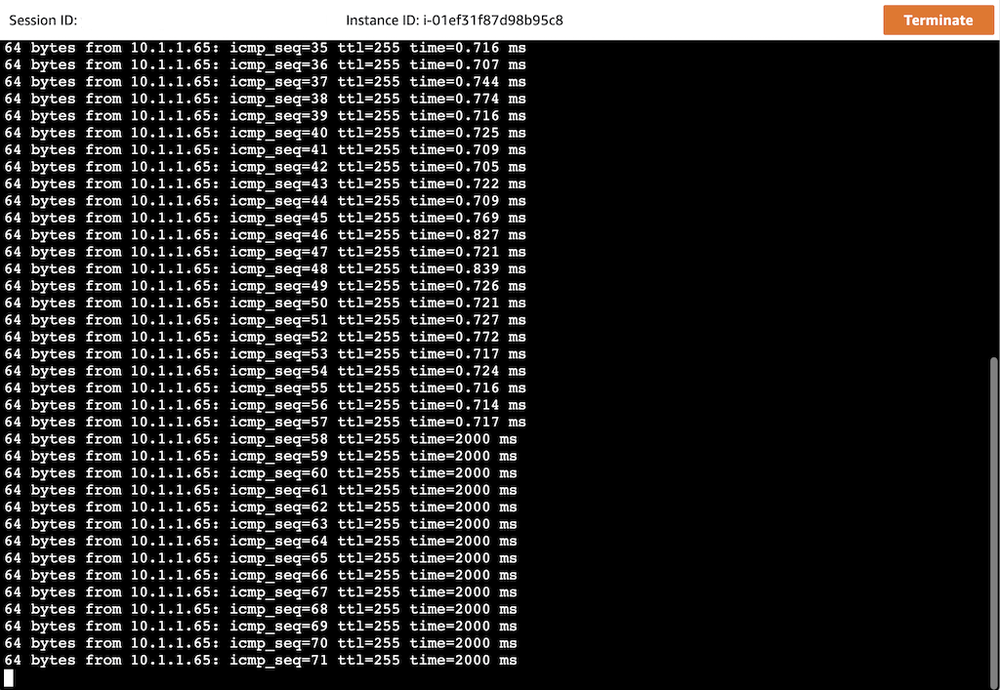
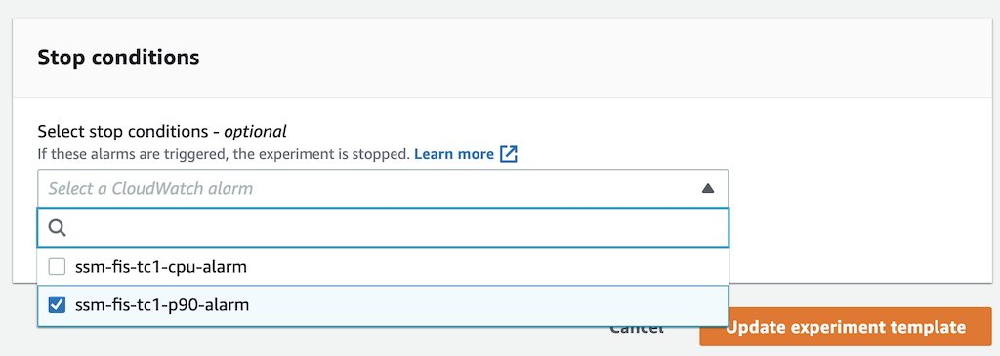
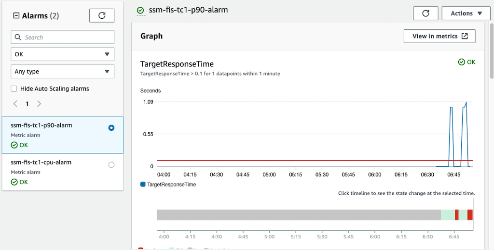
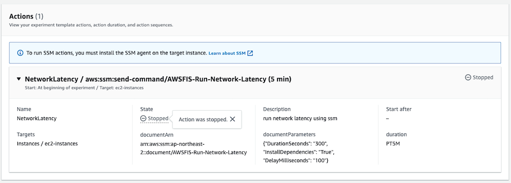
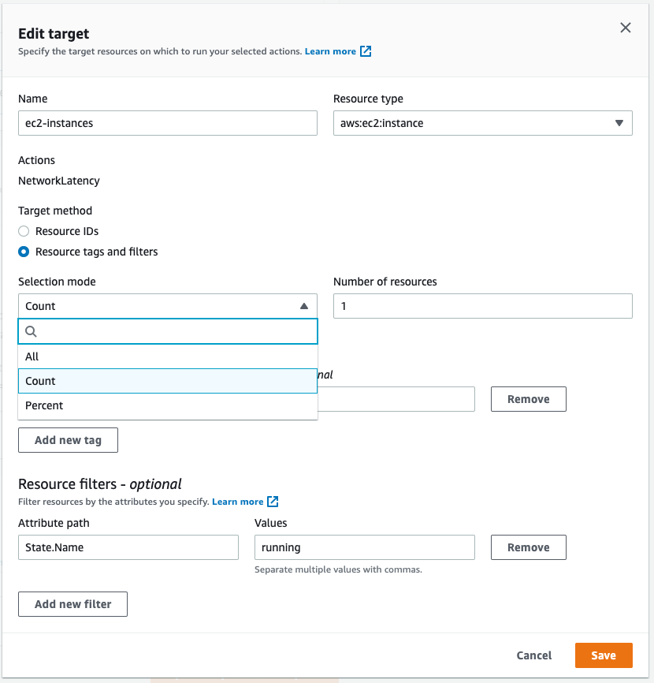
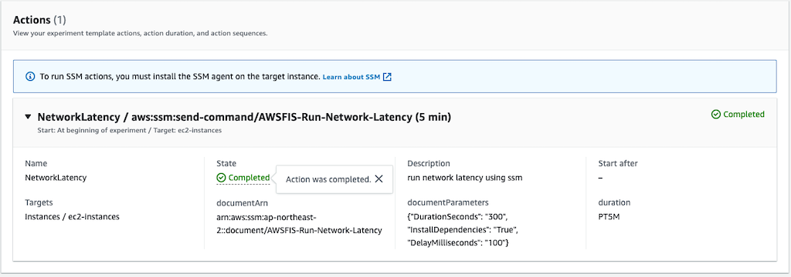
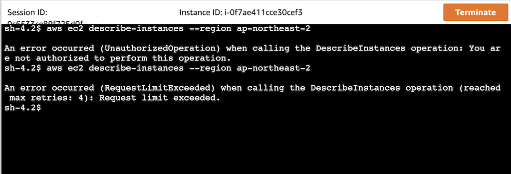
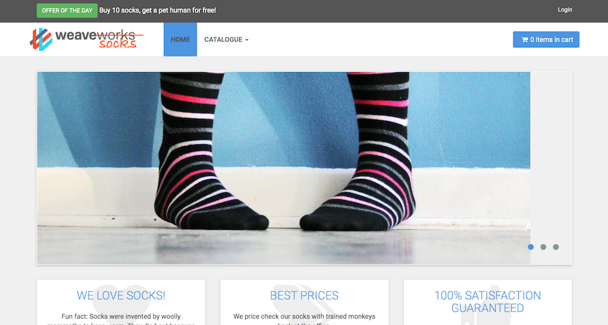
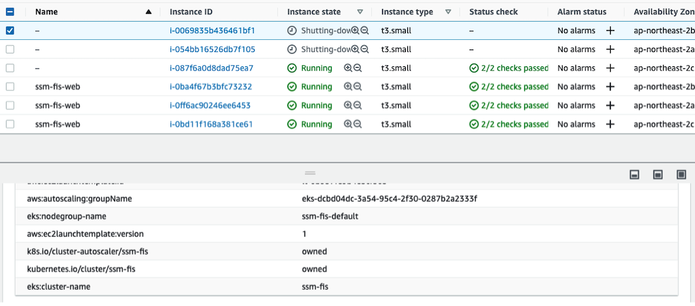
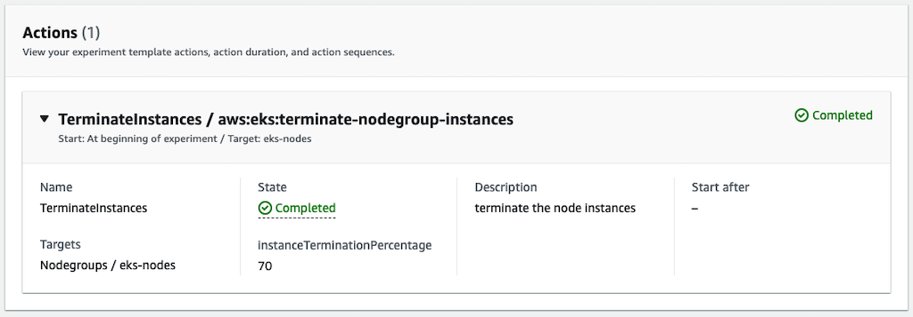

# AWS Fault Injection Simulator
[AWS Fault Injection Simulator](https://aws.amazon.com/fis/) is a fully managed service for running fault injection experiments on AWS that makes it easier to improve an application’s performance, observability, and resiliency. Fault injection experiments are used in chaos engineering, which is the practice of stressing an application in testing or production environments by creating disruptive events, such as sudden increase in CPU or memory consumption, observing how the system responds, and implementing improvements.

## Chaos Engineering
### Why Chaos Engineering
There are many reasons to do chaos engineering. We see teams transitioning in this way to reduce incidents, lower downtime costs, train their teams, and prepare for critical moments. Practicing chaos engineering allows you to detect problems before they become accidents and before customers are affected. And chaos engineering is useful for reducing downtime costs because it allows teams to have a resilient architecture. While the number of companies operating at Internet scale increases and high-traffic events such as sales or launches increase, the cost of downtime will become more expensive. Additionally, this continuous practice of chaos engineering gives teams more confidence every day as they build their own applications and systems. It takes less time to fire-fighting and more time to create and create value.

### How to do Chaos Engineering
To implement Chaos Engineering, one should follow the scientific method to implement experiments:
1. Observe Your System
1. Baseline your metrics
1. Form a Hypothesis with Abort (Stop) Conditions
1. Define Blast Radius
1. Run Experiment
1. Analyze Results
1. Expand Scope and Re-Test
1. Share Results

## Setup
[This](https://github.com/Young-ook/terraform-aws-ssm/blob/main/examples/fis/main.tf) is an example of terraform configuration file to create AWS Fault Injection Simulator experiments for chaos engineering. Check out and apply it using terraform command.

Run terraform:
```
$ terraform init
$ terraform apply
```
Also you can use the `-var-file` option for customized paramters when you run the terraform plan/apply command.
```
$ terraform plan -var-file tc1.tfvars
$ terraform apply -var-file tc1.tfvars
```

## Create Experiment Templates
Run script
```
$ ./fis-create-experiment-templates.sh
```
This script creates fault injection simulator experiment templates on the AWS account. Move to the AWS FIS service page on the AWS Management Conosol and select Experiment templates menu on the left. Then users will see the created experiment templates for chaos engineering.


## Run Experiments
To test your environment, select a experiment template that you want to run and click the `Actions` button on the right top on the screen. You will see `Start experiment` in the middle of poped up menu and select it. And follow the instructions.

### Run Load Generator
Enter an ec2 instance via session manager and run virtual client script runs loop action for http requests on the target application load balancer. You will find out the example script for virtual client load generater on the terraform outputs after terraform apply command is complete. It looks like below.
```
#!/bin/bash
while true; do
  curl -I http://my-loadbalancer-1234567890.us-west-2.elb.amazonaws.com
  echo
  sleep .5
done
```
The all cloudwatch alarms will be chaged to *OK* status from *Insufficient data* in minutes after the load generator script running.

### Network Latency
This test will inject network latency to target instances. A response from the instance will be delayed in specified milisecond defined in the experiment template. To run this example, follow belows.

1. Move on the EC2 service page. Press the `Instances (running)` to switch the screen to show the list of running instances.
1. Select a ec2 instance of autoscaling group that you created by this module. Maybe its name looks like ssm-fis-tc1.
1. Click `Connect` button and choose `Session` tab to access the instance using AWS Session Manager. And finally press the orange `Connect` button and go.
1. You are in the instance, run ping test to the others in the same autoscaling group.
1. Back to the FIS page, Select `NetworkLatency` template in the experiment templates list. Click the `Actions` and `Start experiment` button to start a new chaos experiment.
1. See what happens in the ping logs. The latency will be increased.



#### Define Steady State
First of all, we need to define steady state of the service. This means the service is healthy and working well. We use ‘p90’ to refer to the 90th percentile data; that is, 90% of the observations fall below this value. Percentiles for p90, p95, p99, p99.9, p99.99 or any other percentile from 0.1 to 100 in increments of 0.1% (including p100) of request metric can now be visualized in near real time. We will use this alarm for stop condition of fault injection experiment.

#### Stop Condition
This scenario shows how to abort an experiment when an emergency alert is raised. This is a very important feature for reducing customer impact during chaotic engineering of production systems. Some experiments have a lot of impact on customers during fault injection. If the application goes wrong, the experiment must be stopped autumatically.

##### Update Alarm Source
To test stop condition with cloudwatch alarm, we have to replace the stop condition with p90 latency alarm on the edit page of experiment template on the AWS management console.  This alarm means that our application has latency issues with user responses.

1. Move on the FIS service page.
1. Select `experiment templates` on the navigation bar.
1. Find out `NetworkLatency` template from the list and select.
1. Click `Actions` button and select `Update experiment template` menu to update the template configuration.
1. Scroll down to the bottom of edit page. And update the stop condition alarm to `blah-xxxx-p90-alarm` and save.



#### Run Experiment
We are now ready to start network latecy fault injection and test the emergency stop of aws fault injection simulator is working well to reduce the customer impact. Go to the AWS FIS service page and select `NetworkLatency` from the list of experiment templates. Then use the on-screen `Actions` button to start the experiment. AWS FIS injects network latency into the target, which are the EC2 instances we configured in the experiment template. This will delay all requests from the load generator executed in the previous step by 100ms. This experiment is automatically stopped when the p90 latency alarm is triggered.





#### Architecture Improvements
##### Adjust Targets
After the emergency button test, A new experiment can be started to prove the hypothesis that even if one of the servers in the cluster suddenly slows down, the entire application service can respond within an average of 100 ms.

1. Move on the AWS FIS service page.
1. Select `experiment templates` on the navigation bar.
1. Find out `NetworkLatency` template from the list and select.
1. Click `Actions` button and select `Update experiment template` menu to update the template configuration.
1. Scroll down to `Targets` configuration. And select ec2-instances(aws:ec2:instance) item. Expands the item and click *Edit* button.
1. On the edit target popup window, changed the selection mode with `Count` and set the value of `Number of resources` to 1.
1. Save and close.



##### Scale-out Nodes
Increase the capacity of the ec2 autoscaling group to distribute requests from the load balancer. This will help reduce p90 latency by distributing the load when aws fis creates network latency situations for the target.

1. Go to the Amazon EC2 service page.
1. Select `Autoscaling group` on the bottom of navigation bar.
1. On the Auto Scaling groups page, select the check box next to the Auto Scaling group whose settings you want to manage. The name is something like this `ssm-fis-xxxx`. A split pane opens up in the bottom part of the Auto Scaling groups page, showing information about the group that's selected.
1. In the lower pane, in the Details tab, view or change the current settings for minimum, maximum, and desired capacity.
1. Update the desired capacity to 9.

#### Rerun Experiment
Back to the AWS FIS service page, and rerun the network latency experiment against the updated target to ensure that the API response is in the previously assumed steady state. In this case, the p90 delay alarm is not triggered. That is, 90% of the data points for latency are faster than the threshold. Therefore this experiment will be completed normaly.



### CPU Stress
When you successfully start the CPU stress experiment, the CPU utilization of some target instances increases. You can view this metric on the Monitoring tab displayed when the user selects an ec2 instance, or on the CloudWatch service page.

#### Define Steady State
Before we begin creating failures, a starting point would be to understand the steady state of your application. This includes validating the user experience and revising your dashboard and metrics to understand your systems are operating under normal conditions. Check the monitoring metrics and alarms for API response and CPU utilization on the AWS cloudwatch. If everything looks fine, you can start from there.

#### Run Experiment
#### Architecture Improvements
##### Configure Autoscaling Policy
#### Rerun Experiment

### Terminate EC2 Instances
AWS FIS allows you to test resilience based on ec2 autoscaling group. See what happens when you terminate some ec2 instances in a specific availability zone. This test will check if the autoscaling group launches new instances to meet the desired capacity defined. Use this test to verify that the autoscaling group overcomes the single availability zone failure.

#### Define Steady State
#### Run Experiment

### Throttling AWS API
When running API throttling test, you can see the throttling error when you call the AWS APIs (e.g., DescribeInstances) in the target ec2 instance.

1. Move on the EC2 service page. Press the `Instances (running)` to switch the screen to show the list of running instances.
1. Select a ec2 instance of autoscaling group that you created by this module. Maybe its name looks like ssm-fis-tc1.
1. Click `Connect` button and choose `Session` tab to access the instance using AWS Session Manager. And finally press the orange `Connect` button and go.
1. You are in the instance, run aws command-line interface (cli) to describe instances where region you are in.
1. First try, you will see `Unauthorized` error.
1. Back to the FIS page, Select `ThrottleAPI` template in the experiment templates list. Click the `Actions` and `Start experiment` button to start a new chaos experiment.
1. Then you will see the changed error message when you run the same aws cli. The error message is API Throttling.

Following screenshot shows how it works. First line shows the request and reponse about ec2-describe-instances api using AWS CLI. The error message is `Unauthorized` because the target role the instance has does not have right permission to describe instances. And second line is the reponse of the same AWS API call when throttling event is running. You will find out that the error message has been changed becuase of fault injection experiment.



### Terminate EKS Nodes
AWS FIS allows you to test resilience of EKS cluster node groups. See what happens if you shut down some ec2 nodes for kubernetes pods or services within a certain percentage. This test verifies that the EKS managed node group launches new instances to meet the defined desired capacity and ensures that the application containers continues to run well. Also, this test will help you understand what happens to your application when you upgrade your cluster. At this time, in order to satisfy both resiliency and ease of cluster upgrade, the container should be designed so that it can be moved easily. This makes it easy to move containers running on the failed node to another node to continue working. This is an important part of a cloud-native architecture.

#### Update kubeconfig
Update and download kubernetes config file to local. You can see the bash command like below after terraform apply is complete. Copy this and run it to save the kubernetes configuration file to your local workspace. And export it as an environment variable to apply to the terminal.
```
$ bash -e .terraform/modules/eks/script/update-kubeconfig.sh -r ap-northeast-2 -n ssm-fis -k kubeconfig
$ export KUBECONFIG=kubeconfig
```

#### Microservices Architecture Application
For this lab, we picked up the Sock Shop application. Sock Shop is a microservices architecture sample application that Weaveworks initially developed. They made it open source so it can be used by other organizations for learning and demonstration purposes.

Create the namespace and deploy application.
```
$ kubectl create namespace sock-shop
$ kubectl apply -f manifests/sockshop-complete-demo.yaml
```
Verify that the pod came up fine (ensure nothing else is running on port 8079):
```
$ kubectl -n sock-shop get pod -l name=front-end
```
The output will be something like this:
```
NAME                         READY   STATUS    RESTARTS   AGE
front-end-7b8bcd59cb-wd527   1/1     Running   0          9s
```

##### Local Workspace
In your local workspace, connect through a proxy to access your application's endpoint.
```
$ kubectl -n sock-shop port-forward svc/front-end 8079:80
```
Open `http://localhost:8079` on your web browser. This shows the Sock Shop main page.

##### Cloud9
In your Cloud9 IDE, run the application.
```
$ kubectl -n sock-shop port-forward svc/front-end 8080:80
```
Click `Preview` and `Preview Running Application`. This opens up a preview tab and shows the Sock Shop main page.



🎉 Congrats, you’ve deployed the sample application on your cluster.

#### Run Load Generator
Run load generator inside kubernetes
```
$ kubectl apply -f manifests/sockshop-loadtest.yaml
```

#### Define Steady State
Before we begin a failure experiment, we need to validate the user experience and revise the dashboard and metrics to understand that the systems are working under normal state, in other words, steady state.

#### Run Experiment
Go to the AWS FIS service page and select `TerminateEKSNodes` from the list of experiment templates. Then use the on-screen `Actions` button to start the experiment. AWS FIS shuts down EKS nodes for up to 70% of currently running instances. This value was configured in the experiment template and you can edit this value in the target selection mode configuration if you want to change the number of EKS nodes to shut down You can see the terminated instances on the EC2 service page, and the new instances will appear shortly after the EKS node is shut down.





## Clean up
### Delete experiment templates
Run script
```
$ ./fis-delete-experiment-templates.sh
```

### Delete infrastructure
Run terraform:
```
$ terraform destroy
```
Don't forget you have to use the `-var-file` option when you run terraform destroy command to delete the aws resources created with extra variable files.
```
$ terraform destroy -var-file tc1.tfvars
```