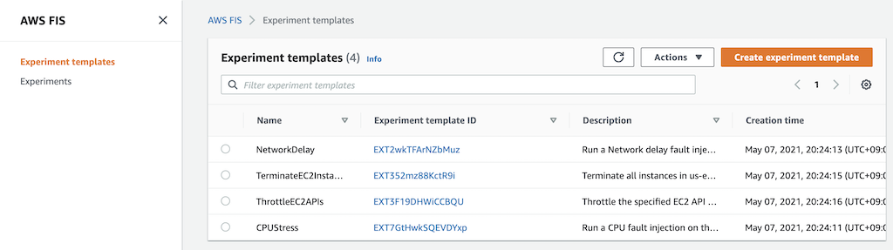
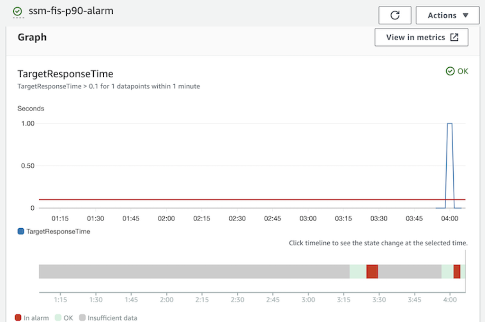

# AWS Fault Injection Simulator
## Setup
[This](https://github.com/Young-ook/terraform-aws-ssm/blob/main/examples/fis/main.tf) is an example of terraform configuration file to create AWS Fault Injection Simulator experiments for chaos engineering. Check out and apply it using terraform command.

Run terraform:
```
$ terraform init
$ terraform apply
```
Also you can use the `-var-file` option for customized paramters when you run the terraform plan/apply command.
```
$ terraform plan -var-file tc1.tfvars
$ terraform apply -var-file tc1.tfvars
```

## Create experiment templates
Run script
```
$ ./fis-create-experiment-templates.sh
```
This script creates fault injection simulator experiment templates on the AWS account. Move to the AWS FIS service page on the AWS Management Conosol and select Experiment templates menu on the left. Then users will see the created experiment templates for chaos engineering.



## Run experiments
To test your environment, select a experiment template that you want to run and click the `Actions` button on the right top on the screen. You will see `Start experiment` in the middle of poped up menu and select it. And follow the instructions.

### CPU Stress
When you successfully start the CPU stress experiment, the CPU utilization of some target instances increases. You can view this metric on the Monitoring tab displayed when the user selects an ec2 instance, or on the CloudWatch service page.

### Network Latency
This test will inject network latency to target instances. A response from the instance will be delayed in specified milisecond defined in the experiment template. To run this example, follow belows.

1. Move on the EC2 service page. Press the `Instances (running)` to switch the screen to show the list of running instances.
1. Select a ec2 instance of autoscaling group that you created by this module. Maybe its name looks like ssm-fis-tc1.
1. Click `Connect` button and choose `Session` tab to access the instance using AWS Session Manager. And finally press the orange `Connect` button and go.
1. You are in the instance, run ping test to the others in the same autoscaling group.
1. Back to the FIS page, Select `NetworkLatency` template in the experiment templates list. Click the `Actions` and `Start experiment` button to start a new chaos experiment.
1. See what happens in the ping logs. The latency will be increased.


### EC2 instances termination
AWS FIS allows you to test resilience based on ec2 autoscaling group. See what happens when you terminate some ec2 instances in a specific availability zone. This test will check if the autoscaling group launches new instances to meet the desired capacity defined. Use this test to verify that the autoscaling group overcomes the single availability zone failure.

### Throttling AWS API
When running API throttling test, you can see the throttling error when you call the AWS APIs (e.g., DescribeInstances) in the target ec2 instance.

1. Move on the EC2 service page. Press the `Instances (running)` to switch the screen to show the list of running instances.
1. Select a ec2 instance of autoscaling group that you created by this module. Maybe its name looks like ssm-fis-tc1.
1. Click `Connect` button and choose `Session` tab to access the instance using AWS Session Manager. And finally press the orange `Connect` button and go.
1. You are in the instance, run aws command-line interface (cli) to describe instances where region you are in.
1. First try, you will see `Unauthorized` error.
1. Back to the FIS page, Select `ThrottleAPI` template in the experiment templates list. Click the `Actions` and `Start experiment` button to start a new chaos experiment.
1. Then you will see the changed error message when you run the same aws cli. The error message is API Throttling.

Following screenshot shows how it works. First line shows the request and reponse about ec2-describe-instances api using AWS CLI. The error message is `Unauthorized` because the target role the instance has does not have right permission to describe instances. And second line is the reponse of the same AWS API call when throttling event is running. You will find out that the error message has been changed becuase of fault injection experiment.


### Stop condition
This scenario shows how to abort an experiment when an emergency alert is raised. This is a very important feature for reducing customer impact during chaotic engineering of production systems. Some experiments have a lot of impact on customers during fault injection. If the application goes wrong, the experiment must be stopped autumatically.

#### Update alarm source
To test stop condition with cloudwatch alarm, we have to replace the stop condition with p90 latency alarm on the edit page of experiment template on the AWS management console. We will use this alarm for stop condition of fault injection experiment. This alarm means that our application has latency issues with user responses.

1. Move on the FIS service page.
1. Select `experiment templates` on the navigation bar.
1. Find out `NetworkLatency` template from the list and select.
1. Click `Actions` button and select `Update experiment template` menu to update the template configuration.
1. Scroll down to the bottom of edit page. And update the stop condition alarm to `blah-xxxx-p90-alarm` and save.


#### Run load generator
Enter an ec2 instance via session manager and run virtual client script runs loop action for http requests on the target application load balancer. You will find out the example script for virtual client load generater on the terraform outputs after terraform apply command is complete. It looks like below.
```
#!/bin/bash
while true; do
  curl -I http://my-loadbalancer-1234567890.us-west-2.elb.amazonaws.com
  echo
  sleep .5
done
```
The cloudwatch alarm will be chaged to OK status in minutes after the load generator script running.

### Network latency injection
We are now ready to start network latecy fault injection and test the emergency stop of aws fault injection simulator is working well to reduce the customer impact.



### Adjust targets
After the emergency button test, we can start a new experiment to prove the hypothesis that when 30% of the servers are shut down, the servers can respond within an average of 100ms.

1. Move on the FIS service page.
1. Select `experiment templates` on the navigation bar.
1. Find out `NetworkLatency` template from the list and select.
1. Click `Actions` button and select `Update experiment template` menu to update the template configuration.
1. Scroll down to the bottom of edit page. And update the stop condition alarm to `blah-xxxx-p90-alarm` and save.


## Clean up
### Delete experiment templates
Run script
```
$ ./fis-delete-experiment-templates.sh
```

### Delete infrastructure
Run terraform:
```
$ terraform destroy
```
Don't forget you have to use the `-var-file` option when you run terraform destroy command to delete the aws resources created with extra variable files.
```
$ terraform destroy -var-file tc1.tfvars
```