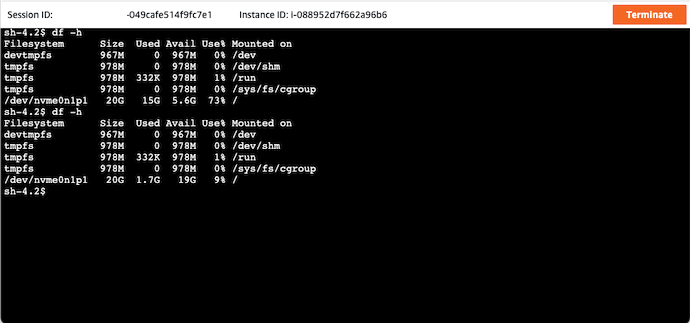

# AWS Systems Manager Document

## Download example
Download this example on your workspace
```sh
git clone https://github.com/Young-ook/terraform-aws-ssm
cd terraform-aws-ssm/examples/ssm-document
```

## Setup
[This](https://github.com/Young-ook/terraform-aws-ssm/blob/main/examples/ssm-document/main.tf) is the example of terraform configuration file to create an EC2 instance which is managed by Systems Manager on your AWS account. Check out and apply it using terraform command.

If you don't have the terraform tools in your environment, go to the main [page](https://github.com/Young-ook/terraform-aws-ssm#terraform) of this repository and follow the installation instructions.

Run terraform:
```
terraform init
terraform apply
```
Also you can use the `-var-file` option for customized paramters when you run the terraform plan/apply command.
```
terraform plan -var-file tc1.tfvars
terraform apply -var-file tc1.tfvars
```

## Run command
You can use Run Command, a capability of AWS Systems Manager, from the console to configure instances without having to log in to each instance.

**To send a command using Run Command**

1. Open the AWS Systems Manager console at https://console.aws.amazon.com/systems-manager/.
1. In the navigation pane, choose Run Command. Or if the AWS Systems Manager home page opens first, choose the menu icon (stacked three bars) to open the navigation pane, and then choose *Run Command*.
1. Choose *Run command*.
1. In the Command document list, choose a Systems Manager document.
1. In the Command parameters section, specify values for required parameters.
1. In the Targets section, identify the instances on which you want to run this operation by specifying tags, selecting instances manually, or specifying a resource group.
1. For Other parameters:
    * For Comment, enter information about this command.
    * For Timeout (seconds), specify the number of seconds for the system to wait before failing the overall command execution.
1. For Rate control:
    * For Concurrency, specify either a number or a percentage of instances on which to run the command at the same time.
1. (Optional) For Output options, to save the command output to a file, select the Write command output to an S3 bucket box. Enter the bucket and prefix (folder) names in the boxes.
1. Choose *Run*.

## Connect
Move to the EC2 service page on the AWS Management Conosol and select Instances button on the left side menu. Find an instance that you launched. Select the instance and click *Connect* button on top of the window. After then you will see three tabs EC2 Instance Connect, Session Manager, SSH client. Select Session Manager tab and follow the instruction on the screen.



## Clean up
Run terraform:
```
terraform destroy
```
Don't forget you have to use the `-var-file` option when you run terraform destroy command to delete the aws resources created with extra variable files.
```
terraform destroy -var-file tc1.tfvars
```
