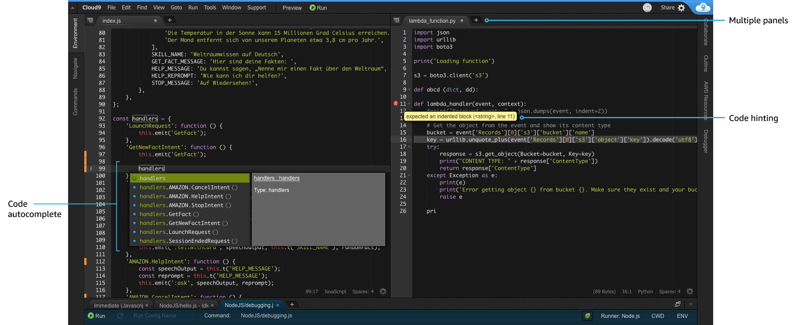

# AWS Cloud9
[AWS Cloud9](https://aws.amazon.com/cloud9/) is a cloud-based integrated development environment (IDE) that lets you write, run, and debug your code with just a browser. It includes a code editor, debugger, and terminal. Cloud9 comes prepackaged with essential tools for popular programming languages, including JavaScript, Python, PHP, and more, so you don’t need to install files or configure your development machine to start new projects. Since your Cloud9 IDE is cloud-based, you can work on your projects from your office, home, or anywhere using an internet-connected machine. Cloud9 also provides a seamless experience for developing serverless applications enabling you to easily define resources, debug, and switch between local and remote execution of serverless applications. Fore more details, please refer to [this page](https://aws.amazon.com/cloud9/details/).



## Setup
### Prerequisites
This module requires *terraform*. If you don't have the terraform tool in your environment, go to the main [page](https://github.com/Young-ook/terraform-aws-ssm) of this repository and follow the installation instructions.

### Quickstart
```
module "vpc" {
  source  = "Young-ook/vpc/aws"
}

module "cloud9" {
  source  = "Young-ook/ssm/aws//modules/cloud9"
  subnet = values(module.vpc.subnets["public"])[0]
}
```

Run terraform:
```
terraform init
terraform apply
```

# Additional Resources
